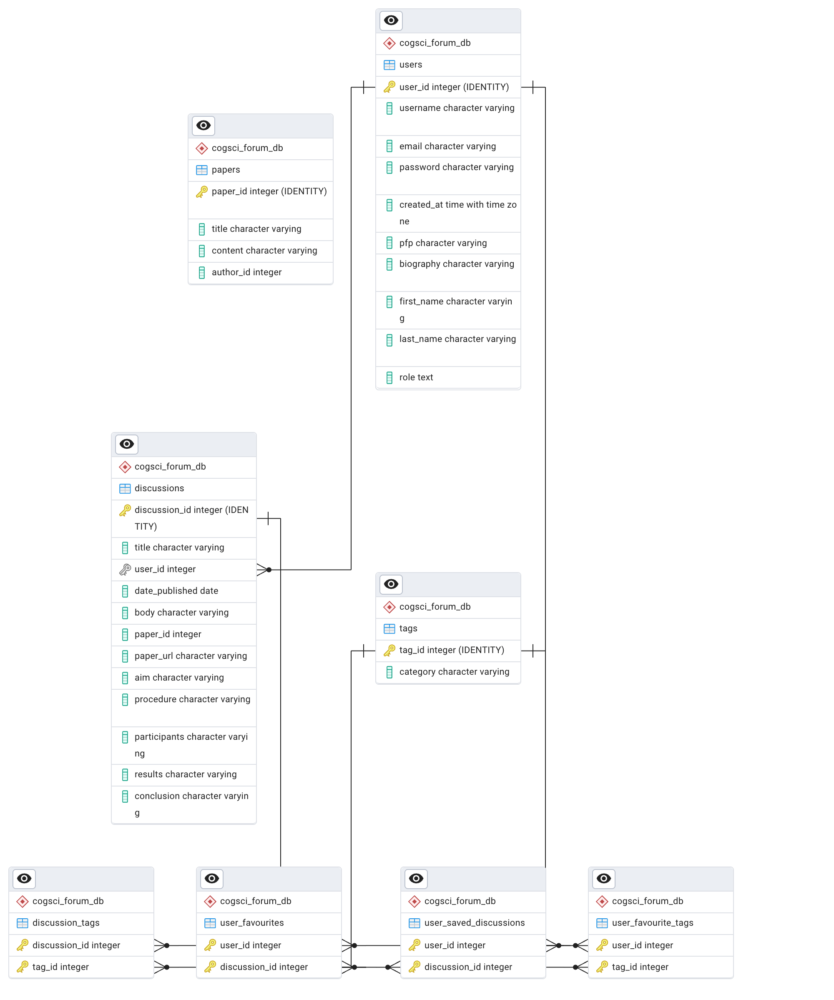

# Cogsci Forum

Cogsci Forum is a full-stack web platform for the cognitive science community to **discover research papers** and **share structured discussions** about them. Cognitive science is inherently interdisciplinary, so the goal of this project is to make research discussion more accessible and community-driven for both **students** and **researchers**.

---

## Live Demo
- **Deployed on Render:** https://cogsci-forum-react-frontend.onrender.com/

---

## What Users Can Do

### Without an account
- Browse and read discussion posts
- Search for scientific papers (via Semantic Scholar)
- Open paper links externally

### With an account
- Create and publish discussion posts
- Optionally attach a discussion to a research paper (paper title + link can be auto-filled)
- Save discussions to a personal profile
- Edit profile information
- Add/remove **interest tags** (foundation for future personalized ranking and recommendations)

### Admin capabilities
- Delete discussions (moderation)
- Publish “featured” discussions as an **official account**, displayed as a “Weekly Newspaper” section on Explore

---

## Key Features
- 🔎 **Paper Search (Semantic Scholar API):** search and display up to 20 papers per query
- 💬 **Discussion Creation:** publish discussions with structured fields (aim, procedure, participants, results, conclusion)
- 💾 **Saved Discussions:** bookmark discussions to revisit later
- 👤 **User Profiles:** edit user profile info and manage interests
- 🏷️ **Tags & Interests:** many-to-many tagging for discussions and user interest tags (enables future personalization)
- 🎞️ **Swiper UI:** carousel/slider display for discussion browsing

---

## Semantic Scholar Integration

Cogsci Forum integrates the **Semantic Scholar Graph API** to support in-app paper search.

- The backend proxies search queries to Semantic Scholar
- Results are formatted and returned to the frontend
- Users can open the paper link and optionally start a discussion from a paper result

Semantic Scholar docs:
https://api.semanticscholar.org/api-docs/graph

---

## Tech Stack

**Frontend**
- React
- CSS + Bootstrap
- Swiper (carousel UI)

**Backend**
- Node.js + Express.js
- Session-based authentication (cookie sessions)
- Middleware-protected routes (e.g., authentication checks)

**Database**
- PostgreSQL (relational design with join tables for many-to-many relationships)

**Security / Config**
- Password hashing with `bcrypt`
- CORS configuration for local and deployed environments
- Sensitive credentials (API keys, DB connection info) stored securely as **server environment variables** (not committed to the repo)

---

## Database Schema

**Core tables**
- `users`
- `discussions`
- `tags`
- `papers`

**Join tables (many-to-many)**
- `discussion_tags` (discussions ↔ tags)
- `user_saved_discussions` (users ↔ saved discussions)
- `user_favourite_tags` (users ↔ interest tags)
- `user_favourites` (users ↔ discussions) *(if used separately from saved discussions)*

---

## Project Structure

- `api/` — Express backend (routes, sessions, DB queries, Semantic Scholar integration)
- `main_application/` — React frontend (UI, routing, API calls, state management)

---

## API Endpoints (Backend)

### Auth
- `POST /signup` — create a new user
- `POST /login` — login with username + password (creates session)
- `POST /logout` — logout (destroys session)
- `GET /me` — returns the current logged-in user (session check)

### Discussions
- `GET /discussions/:id` — retrieve a specific discussion  
- `POST /discussions` — create a discussion (**requires login**)
- `DELETE /discussions` — delete a discussion (**requires login**, only allowed if the discussion belongs to the current user)
- `GET /user/posted` — retrieve discussions posted by all users (Explore page)
- `GET /featuredDiscussions` — retrieve featured discussions (admin/official content)
- `GET /discussion/tag` — retrieve tags attached to a discussion

### Saved discussions
- `GET /user/saved` — retrieve saved discussions for the current user (**requires login**)
- `DELETE /user/saved` — remove a saved discussion from the user profile (**requires login**)

### User profile + interests
- `GET /userInterests` — get the user’s interest tags (**requires login**)
- `PUT /userProfile` — update profile fields (**requires login**)
- `PUT /interestTags` — update interest tags (many-to-many) (**requires login**)
- `DELETE /interestTags` — remove an interest tag (**requires login**)

### Paper search
- `GET /searchResults` — proxies search query to Semantic Scholar and returns up to 20 papers

> Note: Route names and payload shapes are documented at a high level here; specific request/response formats depend on the frontend integration.

---

## Skills Demonstrated
- Full-stack development using **React + Express**
- REST API design with authentication-protected routes
- Session-based auth (cookies) + middleware patterns
- PostgreSQL schema design, including **many-to-many relationships**
- External API integration (Semantic Scholar) and backend proxying
- UI implementation using Bootstrap/CSS + component libraries (Swiper)
- Debugging real deployment issues (CORS, auth/session behavior across environments)

---

## Roadmap
- Threaded comments / replies on discussions
- Filter + sort discussions (tags, keyword, recency, popularity)
- Personalization / ranking using user interest tags
- Optional caching for Semantic Scholar results to reduce repeated requests

---
